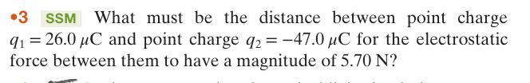

# Aula 1 Física 3

>## Lei de Coulumb   $ F = \frac{1}{4 \pi \epsilon_0} \frac{|q_1| |q_2|}{r^2} $

$\epsilon_0 =  8.85 × 10^{−12} C^2/N · m^2 $
---

 

>## Carga elementar   $ e = 1,602 \cdot 10^{-19} C $

## Exercícios 
**1** , **2**, 4, **7**, **8**, 14, 20, **27**, 28

---
>### 1 

1. $ F = \frac{1}{4 \pi \epsilon_0} \frac{|q_1| |q_2|}{r^2} $

---
# Aula 2 Cap 22 Campo elétrico $\overrightarrow{E}$

- $\overrightarrow{F}$ &rarr; pelo menos 2 corpos
- $\overrightarrow{E}$ &rarr; pelo menos 1 corpo, caracterizar 1 corpo, definido em termos de força
> ## Campo elétrico   $ \overrightarrow{E} = \frac{kq}{r²}  \hat{r} $   $\hat{r}$ radial para fora     $\overrightarrow{F_q} =q\overrightarrow{E} $ onde q é a carga de prova

 

> ## Dipolo elétrico 

# Aula 3~4 Campo elétrico de disco e etc
