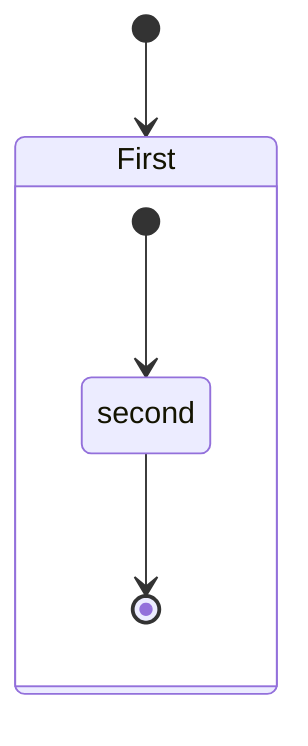

# 2-3-semestre-2022

Repositorio do semestre

## Markdown cheat cheat 

# H1
## H2
### H3

**bold text**
*italicized text*
> blockquote

1. First item
2. Second item
3. Third item

- First item
- Second item
- Third item

`code`

Horizontal Rule
---
Horizontal Rule

[title](https://www.example.com)


| Syntax | Description |
| ----------- | ----------- |
| Header | Title |
| Paragraph | Text |

Fenced Code Block
	```
{
  "firstName": "John",
  "lastName": "Smith",
  "age": 25
}

Here's a sentence with a footnote. [^1]

[^1]: This is the footnote.

### My Great Heading {#custom-id}

term
: definition

~~The world is flat.~~

- [x] Write the press release
- [ ] Update the website
- [ ] Contact the media

That is so funny! :joy:

I need to highlight these ==very important words==.

H~2~O

X^2^

math
<p>

$x=1$

<p>



First line with two spaces after.  
And the next line.

First line with the HTML tag after.<br>
And the next line.

